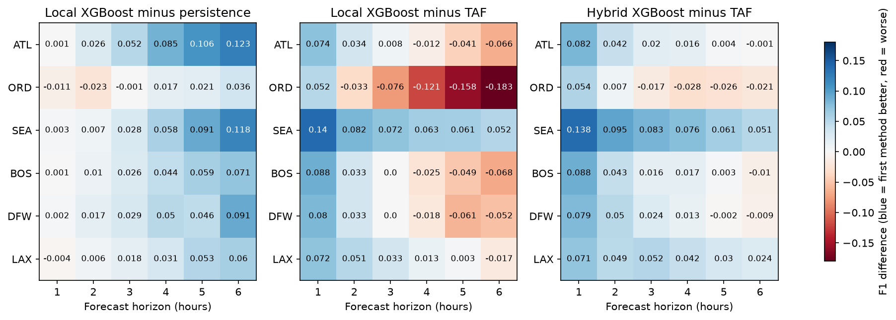
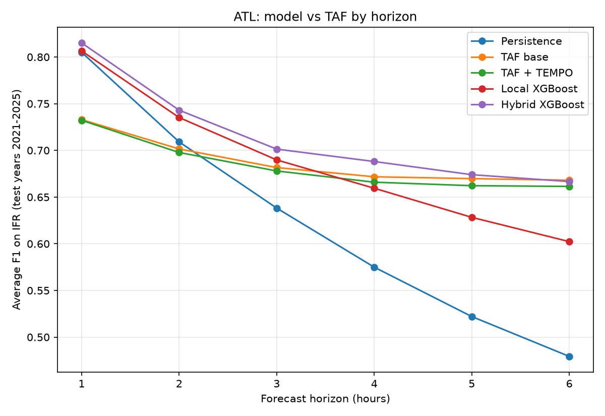

# taf-ml: Can machine learning match the airport forecast?

Forecasting IFR (instrument flight rules) weather at six U.S. airports, 1 to 6 hours ahead, from live airport observations. The models are compared against two baselines: **persistence** ("conditions stay the same") and the **official TAF** (Terminal Aerodrome Forecast) written by National Weather Service forecasters. The project covers data collection, labeling, feature engineering, walk-forward evaluation, a hybrid model, a live prediction API, and a dashboard.




## Summary of findings

- **Learned models add nothing at 1 hour, and a lot by 6 hours.** At every airport, XGBoost is within 0.011 F1 of persistence at 1 hour. At 6 hours it is ahead at all six airports, by +0.036 (ORD) to +0.123 (ATL).
- **Against the official TAF, it depends on the horizon.** A model using only local observations beats the TAF at 1 to 2 hours at five of six airports (Chicago is the exception at 2 hours). At 3 hours it is level with the TAF at Atlanta, Boston, and Dallas, ahead at Seattle and Los Angeles, and behind at Chicago. At 6 hours it is behind at five of six airports (Seattle is the exception). Much of the short-range advantage comes from having a fresh observation, since persistence also beats the TAF at 1 hour.
- **A hybrid model that also sees the TAF forecast is the most robust.** It is ahead of the TAF or within about 0.01 F1 of it at every horizon at five of six airports, and clearly ahead at Seattle (+0.051 to +0.138) and Los Angeles (+0.024 to +0.071).
- **Skill is airport-dependent.** At Chicago O'Hare the TAF is the strongest method from 3 hours on and learned models barely beat persistence. At Seattle the models beat the TAF at every horizon. Claims in this README are therefore stated per airport, not as a single number.
- **Two validation steps caught a real data bug** (vertical-visibility reports were ignored in the training data). See [Data quality](#data-quality-a-bug-the-live-check-caught).

## The question

Aviation weather is grouped into flight categories. This project predicts the most safety-relevant boundary:

| Category | Ceiling | Visibility |
|---|---|---|
| VFR | above 3,000 ft | more than 5 mi |
| MVFR | 1,000 to 3,000 ft | 3 to 5 mi |
| IFR | 500 to under 1,000 ft | 1 to under 3 mi |
| LIFR | under 500 ft | under 1 mi |

The **target** is binary: will the airport be **IFR or LIFR** (ceiling under 1,000 ft or visibility under 3 miles) *h* hours from now, for *h* = 1 to 6? IFR hours are rare (5% to 9% of hours), so accuracy is misleading and models are scored with **F1 on the IFR class**.

### Airports

| Airport | Share of hours IFR or worse | Why it was chosen |
|---|---|---|
| ATL (Atlanta) | 8.9% | Southeast; fog and low cloud |
| ORD (Chicago) | 6.5% | Midwest; frontal weather and winter |
| SEA (Seattle) | 7.4% | Pacific Northwest; low cloud and fog |
| BOS (Boston) | 8.7% | Northeast; coastal fog |
| DFW (Dallas) | 5.1% | Southern plains; fog and thunderstorms |
| LAX (Los Angeles) | 9.2% | Coastal marine layer |

Eleven candidates were scouted first; Orlando (3.0% IFR) was dropped because it had too few IFR hours to score reliably. Each airport has about 60,000 hourly rows (2019 to 2025) per horizon.

## Results

All numbers are average F1 on IFR across five walk-forward test years (2021 to 2025). Methods are scored on identical hours. Differences under about **0.01** are within run-to-run noise (changing a random seed or fixing a data bug moved averages by up to that much), so treat them as ties.

### Difference tables (first method minus second; positive means the first method is better)

**Local-observation XGBoost minus persistence**

| | 1h | 2h | 3h | 4h | 5h | 6h |
|---|---|---|---|---|---|---|
| ATL | +0.001 | +0.026 | +0.052 | +0.085 | +0.106 | +0.123 |
| ORD | -0.011 | -0.023 | -0.001 | +0.017 | +0.021 | +0.036 |
| SEA | +0.003 | +0.007 | +0.028 | +0.058 | +0.091 | +0.118 |
| BOS | +0.001 | +0.010 | +0.026 | +0.044 | +0.059 | +0.071 |
| DFW | +0.002 | +0.017 | +0.029 | +0.050 | +0.046 | +0.091 |
| LAX | -0.004 | +0.006 | +0.018 | +0.031 | +0.053 | +0.060 |

**Local-observation XGBoost minus the official TAF**

| | 1h | 2h | 3h | 4h | 5h | 6h |
|---|---|---|---|---|---|---|
| ATL | +0.074 | +0.034 | +0.008 | -0.012 | -0.041 | -0.066 |
| ORD | +0.052 | -0.033 | -0.076 | -0.121 | -0.158 | -0.183 |
| SEA | +0.140 | +0.082 | +0.072 | +0.063 | +0.061 | +0.052 |
| BOS | +0.088 | +0.033 | 0.000 | -0.025 | -0.049 | -0.068 |
| DFW | +0.080 | +0.033 | 0.000 | -0.018 | -0.061 | -0.052 |
| LAX | +0.072 | +0.051 | +0.033 | +0.013 | +0.003 | -0.017 |

**Hybrid XGBoost (local observations plus the TAF forecast) minus the official TAF**

| | 1h | 2h | 3h | 4h | 5h | 6h |
|---|---|---|---|---|---|---|
| ATL | +0.082 | +0.042 | +0.020 | +0.016 | +0.004 | -0.001 |
| ORD | +0.054 | +0.007 | -0.017 | -0.028 | -0.026 | -0.021 |
| SEA | +0.138 | +0.095 | +0.083 | +0.076 | +0.061 | +0.051 |
| BOS | +0.088 | +0.043 | +0.016 | +0.017 | +0.003 | -0.010 |
| DFW | +0.079 | +0.050 | +0.024 | +0.013 | -0.002 | -0.009 |
| LAX | +0.071 | +0.049 | +0.052 | +0.042 | +0.030 | +0.024 |

### Three airports in full (average F1)

**Atlanta**

| Horizon | Persistence | TAF | TAF + TEMPO | Local XGBoost | Hybrid XGBoost |
|---|---|---|---|---|---|
| 1h | 0.805 | 0.733 | 0.732 | 0.807 | 0.815 |
| 2h | 0.709 | 0.702 | 0.698 | 0.735 | 0.743 |
| 3h | 0.638 | 0.682 | 0.678 | 0.690 | 0.701 |
| 4h | 0.575 | 0.672 | 0.666 | 0.659 | 0.688 |
| 5h | 0.522 | 0.670 | 0.662 | 0.628 | 0.674 |
| 6h | 0.479 | 0.668 | 0.661 | 0.602 | 0.667 |

**Chicago O'Hare** (the TAF dominates)

| Horizon | Persistence | TAF | TAF + TEMPO | Local XGBoost | Hybrid XGBoost |
|---|---|---|---|---|---|
| 1h | 0.792 | 0.730 | 0.699 | 0.782 | 0.784 |
| 2h | 0.679 | 0.688 | 0.661 | 0.656 | 0.696 |
| 3h | 0.595 | 0.670 | 0.639 | 0.593 | 0.653 |
| 4h | 0.529 | 0.666 | 0.634 | 0.546 | 0.638 |
| 5h | 0.481 | 0.660 | 0.634 | 0.502 | 0.635 |
| 6h | 0.435 | 0.654 | 0.630 | 0.471 | 0.634 |

**Seattle** (the models dominate)

| Horizon | Persistence | TAF | TAF + TEMPO | Local XGBoost | Hybrid XGBoost |
|---|---|---|---|---|---|
| 1h | 0.710 | 0.573 | 0.605 | 0.713 | 0.711 |
| 2h | 0.581 | 0.506 | 0.530 | 0.588 | 0.601 |
| 3h | 0.498 | 0.454 | 0.471 | 0.526 | 0.537 |
| 4h | 0.422 | 0.417 | 0.428 | 0.480 | 0.493 |
| 5h | 0.364 | 0.394 | 0.403 | 0.455 | 0.455 |
| 6h | 0.313 | 0.379 | 0.387 | 0.431 | 0.430 |



### Interpretation

- **Why persistence is hard to beat at 1 hour:** the next hour is nearly the same as this one, so there is little for a model to add. The gap grows with the horizon because persistence degrades fastest.
- **Why the local model loses to the TAF at long range** is a hypothesis, not a finding: forecasters see weather-model guidance about what is coming (fronts, moisture transport) that current observations at one airport cannot show. The hybrid model's gain over the local-only model grows with the horizon at five of six airports (Seattle is the exception), which is consistent with this.
- **The short-range advantage over the TAF is partly about timing.** A TAF is often written hours before the hour it covers, while the model sees the latest observation.
- **Why Seattle looks different** is also unexplained. A parsing check confirmed the Seattle TAF scores are not an artifact. One guess is that ceilings there hover near the 1,000 ft IFR boundary, so small errors flip the category.

## Method

### Data

| Source | Used for |
|---|---|
| [Iowa Environmental Mesonet](https://mesonet.agron.iastate.edu/) ASOS archive | Hourly and special METAR observations, 2019 to 2025 |
| Iowa Environmental Mesonet TAF archive | Historical TAFs, 2019 to 2025 |
| [Aviation Weather Center](https://aviationweather.gov/) data API | Live METARs for the prediction service |

### Labeling and features

Each observation is labeled with a flight category from its ceiling (lowest broken or overcast layer, or vertical visibility) and visibility. Observations are reduced to one per hour (the last report in the hour) on a gap-free hourly timeline. The target is the IFR-or-worse status *h* rows later.

There are 28 features, all computed from the present and the past only (nothing looks forward):

- Current conditions: temperature, dewpoint, relative humidity, wind speed and gusts, altimeter and sea-level pressure, visibility, ceiling
- Temperature-dewpoint spread (a fog indicator) and wind direction as sine and cosine
- 1, 3, and 6-hour pressure changes; 3-hour changes in spread, visibility, and temperature
- 6-hour minimum visibility and ceiling, and the number of IFR hours in the last 6
- Flags for fog, mist, rain, and thunderstorms in the weather string
- Hour of day, month, and whether the airport is IFR right now

### Models

- **Persistence:** predict that the airport stays in its current IFR state.
- **Logistic regression:** a simple learned baseline.
- **XGBoost:** 300 trees, depth 4, learning rate 0.05, row and column subsampling of 0.8, fixed seed.
- **Hybrid XGBoost:** the same model plus the TAF's forecast category for the target hour (three numeric features).
- **LSTM (PyTorch), ATL only:** a first-pass sequence model on the last 12 hours of features. It beat persistence but trailed XGBoost by about 0.03 F1 at 3 and 6 hours. It was not tuned and was run before the data fix described below.

### Evaluation

- **Walk-forward by year.** For each test year from 2021 to 2025, models train on all years before the previous year, the previous year is used for validation, and the test year is scored. A random split would leak information between neighboring hours.
- **The decision threshold is chosen on the validation year only** (the cutoff that maximizes F1), then applied unchanged to the test year.
- **Scoring is F1 on the IFR class**, because always predicting "not IFR" would be about 91% accurate and useless.

### The TAF baseline

TAFs are archived as one row per forecast group (initial conditions, `FM` changes, `TEMPO`, `PROB30`). For each hour, the baseline takes the most recent TAF issued by the end of that hour (and no more than 8 hours old) and finds the group in effect *h* hours later. "TAF" uses base forecast groups only. "TAF + TEMPO" takes the worse of the base forecast and any TEMPO group in effect. (A further variant that also counted PROB30 groups was tested at Atlanta and behaved almost identically.) The hybrid model receives all three versions as numeric features. Using the end of the hour as the decision time gives the TAF every chance to have been updated.

## Data quality: a bug the live check caught

Before building the live service, features computed from the live Aviation Weather Center feed were compared with features computed from the archive for the same recent hours. At Seattle, the ceiling differed enormously in dense-fog hours. Two separate problems were found:

1. **The training data had a bug.** The archive stores sky cover in a fixed three-character field, so vertical visibility arrives as `"VV "` with a trailing space. The ceiling function matched `"VV"` exactly, so every vertical-visibility report was silently treated as "no ceiling."
2. **The live feed uses different units.** Despite its schema saying feet, the Aviation Weather Center reports vertical visibility in hundreds of feet (`VV001` arrives as 1). The converter now reads it from the raw METAR text.

After fixing both and rerunning everything: IFR labels were unchanged at five airports and gained 14 hours (0.25%) at Los Angeles, and average F1 scores moved by 0.009 or less, so none of the conclusions changed. The live check was rerun at Atlanta and Seattle:

- Ceiling differences between the two sources dropped to zero.
- Temperature differed by at most 0.08 °F and humidity by at most about 0.5 points (rounding and formula differences).
- Saved-model probabilities differed by under 0.01 on average, and IFR yes/no calls agreed 96% to 100% of the time.

## Live prediction service

A FastAPI service fetches the latest observations, builds the same 28 features with the shared feature code, and runs the saved model for each horizon. Results are cached for 5 minutes per airport to respect the Aviation Weather Center's rate limits, and the service returns a clear error if observations are missing or more than 3 hours old.

```
GET /predict/ATL
{
  "station": "ATL",
  "raw_metar": "METAR KATL 060152Z 09006KT 10SM SCT200 22/19 A3010 ...",
  "currently_ifr": false,
  "predictions": [
    {"horizon_hours": 1, "probability_ifr": 0.084, "ifr_expected": false,
     "threshold": 0.5, "model_adds_skill": false, ...},
    {"horizon_hours": 6, "probability_ifr": 0.487, "ifr_expected": true,
     "threshold": 0.25, "model_adds_skill": true, ...}
  ],
  "disclaimer": "..."
}
```

Each prediction includes the model's cross-validated F1 next to persistence's, and `model_adds_skill` is false wherever the model did not beat persistence by more than 0.01 in testing (for example Chicago at short range). Interactive API docs are available at `/docs`.

A Streamlit dashboard shows the current report, a bar chart of IFR probability by hour with each horizon's alert level, and a caution wherever the model is no better than "stays the same."


## Repository layout

```
src/
  pipeline.py            data loading, labeling, and feature engineering (shared by everything)
  build_dataset.py       build the feature table for one airport and horizon
  run_cv.py              walk-forward cross-validation for one airport and horizon
  run_batch.py           run everything for all airports and horizons, plus TAF comparisons
  download_taf.py        download TAF archives
  taf_tools.py           TAF parsing and forecast lookup
  taf_horizons.py        persistence vs TAF vs local vs hybrid models, one airport
  train_final.py         train and save the final models (models/)
  summarize_airports.py  cross-airport comparison tables and heatmap
  scout_airports.py      screen candidate airports by IFR frequency
  live_data.py           convert live Aviation Weather Center data into model features
  check_skew.py          compare live-derived features and predictions with the archive
  test_live.py           inspect the live data converter
  api.py                 FastAPI prediction service
  dashboard.py           Streamlit dashboard
  run_lstm.py            PyTorch LSTM experiment

  Earlier single-airport (ATL) experiments, superseded by the multi-airport pipeline:
  download_data.py, prepare_data.py, build_hourly.py, features.py, train_models.py,
  cross_validate.py, tune_xgb.py, trim_features.py, shap_analysis.py, taf_baseline.py,
  hybrid_cv.py, pr_curve.py, look.py, look_taf.py, check_taf_parsing.py
models/                  saved XGBoost models and their settings (36 files plus info files)
results/                 metrics (JSON/CSV) and charts
data/                    downloaded data (not committed)
```

## Reproducing the results

Requires Python 3.11. On macOS, XGBoost also needs `brew install libomp`.

```bash
git clone https://github.com/<your-username>/taf-ml.git
cd taf-ml
python -m venv venv
source venv/bin/activate
python -m pip install pandas requests scikit-learn xgboost matplotlib fastapi uvicorn streamlit
# optional, for the extra experiments: python -m pip install shap torch

# 1. Download data, build all datasets, run cross-validation and the TAF comparisons
#    (about two hours; set STATIONS in src/run_batch.py to the six airports first)
python src/run_batch.py

# 2. Train and save the final models
python src/train_final.py

# 3. Cross-airport tables and heatmap
python src/summarize_airports.py

# 4. Run the live service and dashboard (two terminals)
python -m uvicorn api:app --app-dir src
python -m streamlit run src/dashboard.py
```

On macOS, PyTorch and XGBoost can crash when loaded in the same process (an OpenMP conflict). `src/run_lstm.py` sets `OMP_NUM_THREADS=1` and single-threaded PyTorch to avoid this.

## Limitations

- **Six airports and five test years.** There are no confidence intervals; I treat gaps under about 0.01 F1 as ties, based on the variation seen when seeds or data changed.
- **One target.** Only the IFR-or-worse boundary is predicted, not individual flight categories.
- **Design choices in the TAF baseline** (end-of-hour decision time, base groups vs TEMPO groups, an 8-hour staleness limit) affect the comparison. Both TAF variants are reported.
- **Short-range wins partly reflect timing**, as noted above.
- **Probabilities are not calibrated.** The alert level for each horizon maximizes F1 and sits well below 50%, so a probability of 30% can be flagged. Calibration was not evaluated.
- **The live pipeline approximates a few archive fields.** Relative humidity uses a standard formula that differs slightly from the archive's, temperature has finer precision, and missing sea-level pressure falls back to the altimeter setting. The live path made slightly fewer IFR calls than the archive path at the longer horizons in the one-week checks (for example 24 vs 29 at 5 hours at Atlanta), which is within sampling noise for one week but worth noting.
- **The skew check covers about one week at three airports** (and Los Angeles had no IFR hours that week).
- **The LSTM was untuned**, and the ATL-only experiments (feature trimming, hyperparameter search, SHAP, precision-recall curve, LSTM) ran on the dataset before the vertical-visibility fix. Their conclusions are consistent with the final results but their exact numbers are not reported here.
- **The explanations for airport differences are hypotheses**, not tested findings.

## Future work

- Add observations from upwind stations, which could help most at Chicago where local data was weakest.
- Train one pooled model across airports.
- Evaluate and apply probability calibration.
- Add bootstrap confidence intervals over days or weeks.
- Tune the LSTM and try other sequence models.
- Extend to more airports and to a category forecast (VFR, MVFR, IFR, LIFR) instead of a binary target.

## Data sources and acknowledgments

Observations and TAF archives come from the Iowa Environmental Mesonet. Live observations come from the Aviation Weather Center's public data API. This project uses them within their published usage guidance (a custom user agent, requests cached for several minutes, and well under the rate limits).

